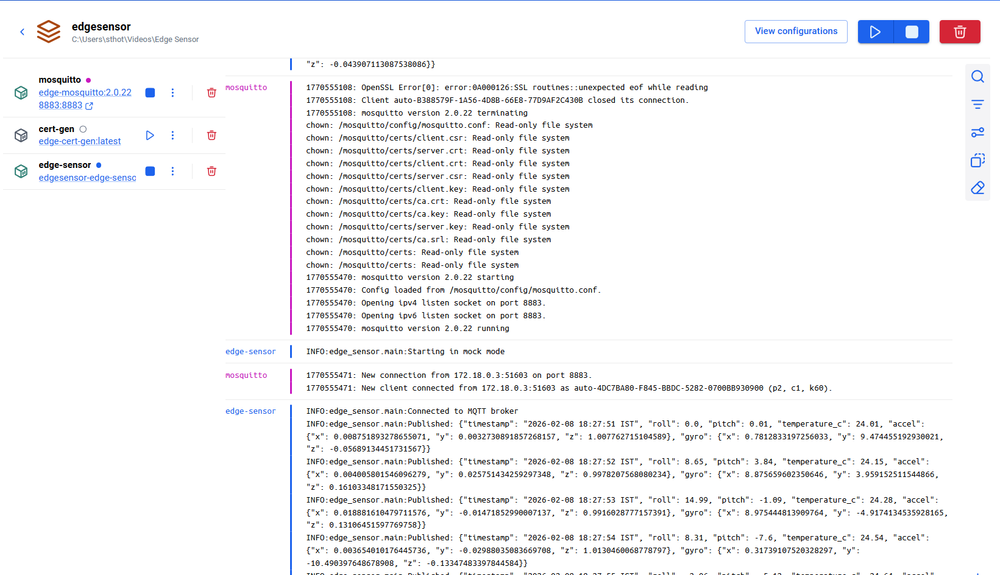

# Edge Sensor Fusion and Analytics Node

This project provides a Raspberry Pi 4 edge analytics node that reads IMU (I2C) and temperature (SPI) sensors, fuses the IMU data, and publishes results to an MQTT broker over TLS. A mock mode is included so the stack runs without hardware.

## Highlights

- IMU (MPU6050) and SPI temperature sensor acquisition
- Kalman filter based attitude estimation (roll, pitch)
- TLS-secured MQTT publishing with client certificates
- Dockerized stack with Mosquitto broker and cert generator
- Mock mode for hardware-free validation

## Quick Start

1. Build images:

   ```bash
   docker compose build --no-cache
   ```

2. Start the stack:

   ```bash
   docker compose up -d
   ```

3. Tail logs:

   ```bash
   docker compose logs --tail=50 edge-sensor mosquitto
   ```

The logs will show JSON payloads being published to the broker.

## Hardware Setup 

- IMU: MPU6050 on I2C (default address 0x68)
- Temperature: SPI sensor (example: MAX6675)

Set `SENSOR_MODE=hardware` and configure I2C/SPI values via environment variables in [docker-compose.yml](docker-compose.yml).

Install the hardware dependencies:

```bash
pip install -r requirements-hw.txt
```

## Project Structure

- `src/` application code
- `src/sensors/` hardware and mock drivers
- `src/fusion/` sensor fusion logic
- `docker/` Mosquitto configuration and cert generator Dockerfiles
- `scripts/` helper scripts

## Configuration

Environment variables:

- `SENSOR_MODE` = `mock` (default) or `hardware`
- `MQTT_HOST`, `MQTT_PORT` = broker host/port
- `MQTT_TOPIC` = publish topic
- `MQTT_TLS_CA`, `MQTT_TLS_CERT`, `MQTT_TLS_KEY` = TLS files
- `MQTT_TLS_INSECURE` = `false` to validate broker certs
- `PUBLISH_INTERVAL_SEC` = publish interval
- `I2C_BUS`, `IMU_ADDRESS` = I2C settings
- `SPI_BUS`, `SPI_DEVICE` = SPI settings

## Sample Logs

```
INFO edge_sensor.main: Starting in mock mode
INFO edge_sensor.main: Connected to MQTT broker
INFO edge_sensor.main: Published: {"timestamp": "2026-02-08 17:43:45 IST", "roll": 7.18, "pitch": -1.11, "temperature_c": 22.07, "accel": {"x": 0.0007, "y": 0.0091, "z": 0.9981}, "gyro": {"x": 9.148, "y": -3.444, "z": -0.122}}
mosquitto | New client connected from 172.18.0.3 as edge-sensor (TLS).
```

## Built Images

- edge-sensor app: `edgesensor-edge-sensor:latest`
- mosquitto broker: `edge-mosquitto:2.0.22`
- cert generator: `edge-cert-gen:latest`

## Submission Evidence

- Sample MQTT publish logs are shown above.
- Image names used for the build are listed in Built Images.
- Optional: include a Docker Desktop screenshot only if required by the portal.



## Docker Checks

```bash
docker compose ps -a
docker compose logs -f edge-sensor
docker compose logs mosquitto
docker image ls
```

If Docker Scout is available:

```bash
docker scout cves edgesensor-edge-sensor:latest
```

## Verification

Run these commands and compare the expected outputs:

```bash
docker compose ps
```

- `edge-sensor` shows `Up` (or `running`)
- `mosquitto` shows `Up` (or `running`)

```bash
docker compose logs --tail=10 edge-sensor
```

- Lines include `Published:` with JSON payloads

```bash
docker compose logs --tail=10 mosquitto
```

- Lines include `New client connected` over TLS

## Notes

- The default compose flow generates self-signed certs in a Docker volume and runs Mosquitto on TLS port 8883.
- To use your own certificates, replace files in the `mosquitto-certs` volume or run `python scripts/generate_certs.py` and mount the output.
- If you see "Unable to load CA certificates", reset the volume with `docker compose down -v` and start the stack again.
